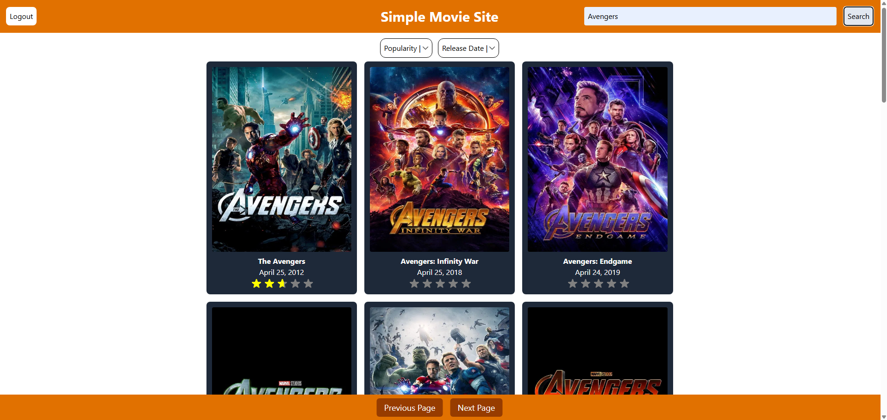
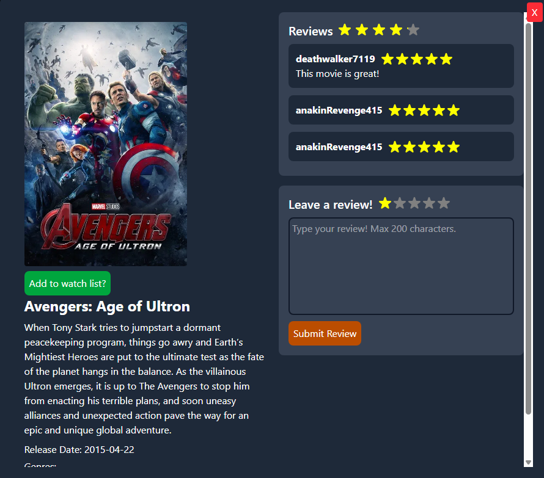
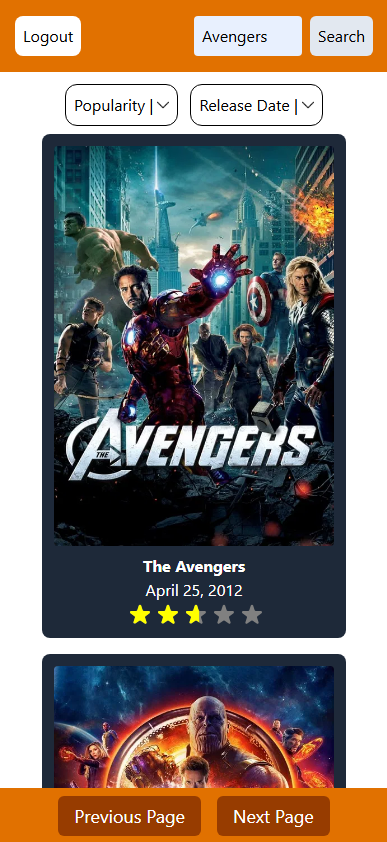
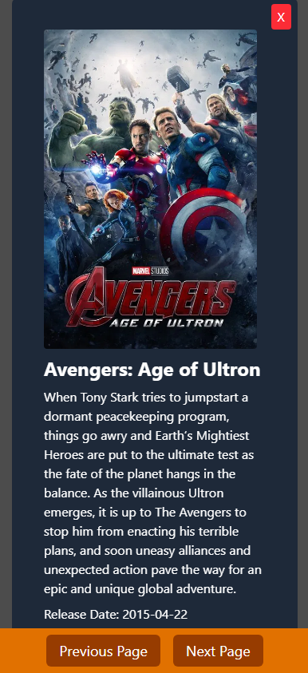
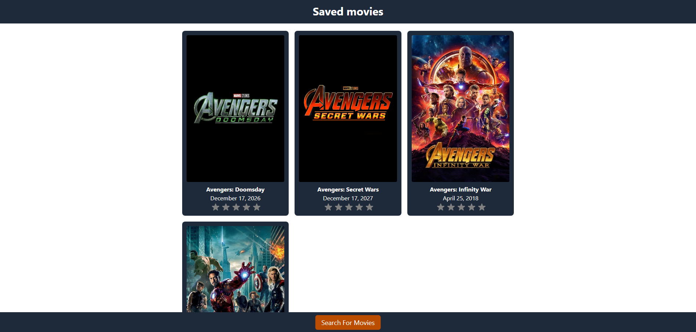

# Movie Explorer

A React + Express application where users can browse movies, submit reviews with star ratings, and view the latest reviews.

---

## Features

- Search and View movies using TMDB
- Sort movies by different metrics
- User registration and login (with session authentication)
- Submit movie reviews with star ratings (1-5 stars)
- View the 4 most recent reviews for each movie
- Responsive modal for movie details and reviews
- Responsive webpage for all screeen sizes
- Passwords securely hashed with bcrypt
- Session handling with `express-session`

## Screenshots

### A full view of the website with movies loaded (desktop):



### A view of the details page for a specific movie (desktop):



### A full view of the website with movies loaded (mobile):



### A view of the details page for a specific movie (mobile):



### A view of the saved movies page (desktop):



## Installation

### Clone the repo:

```
git clone https://github.com/llfisher932/Simple-Movie-Website.git
cd simple-movie-website
```

### Install dependencies:

Backend:

```
cd backend
npm install
```

Frontend:

```
cd ../frontend
npm install
```

### Environment Variables:

Rename .env.example file to .env and adjust the variables.

### Database Setup:

Run the following commands in a PostgreSQL database:

```
CREATE TABLE users (
  id SERIAL PRIMARY KEY,
  username TEXT UNIQUE NOT NULL,
  email TEXT UNIQUE NOT NULL,
  password_hash TEXT NOT NULL,
  created_at TIMESTAMP DEFAULT CURRENT_TIMESTAMP
);

CREATE TABLE reviews (
  review_id SERIAL PRIMARY KEY,
  user_id INTEGER REFERENCES users(id),
  movie_id TEXT NOT NULL,
  review_text TEXT NOT NULL,
  review_number INTEGER NOT NULL,
  created_at TIMESTAMP DEFAULT CURRENT_TIMESTAMP
);

CREATE TABLE saved_movies (
    id SERIAL PRIMARY KEY,
    user_id INTEGER NOT NULL,
    movie_id INTEGER NOT NULL,
    saved_at TIMESTAMPTZ DEFAULT NOW(),

    UNIQUE (user_id, movie_id),

    FOREIGN KEY (user_id) REFERENCES users(id) ON DELETE CASCADE
);

```

### Running the app:

```
cd backend
node server.js
```

```
cd ../frontend
npm run dev
```

---

## Usage

- Register a new account or log in.

- Browse movies and click on a movie to open the modal.

- Read existing reviews or leave your own review with a star rating and optional text.

- Reviews are submitted and appear immediately without refreshing.

- Save movies to watch them later or remove them from the list.

---

## Technologies

- **Frontend:** React, Tailwind CSS, Vite
- **Backend:** Node.js, Express, express-session, CORS
- **Database:** PostgreSQL (via `pg` library)
- **Authentication & Security:** bcrypt (password hashing), session cookies
- **Other:** dotenv (environment variables), fetch API for client-server requests

---

## Notes

- Some movies may not have posters.
- Requires a TMDB API key.
- Mobile UI needs to be updated for watch later button, currently broken. (Hamburger menu will be used)

## License

This project is licensed under the MIT License - see the [LICENSE](LICENSE) file for details.
