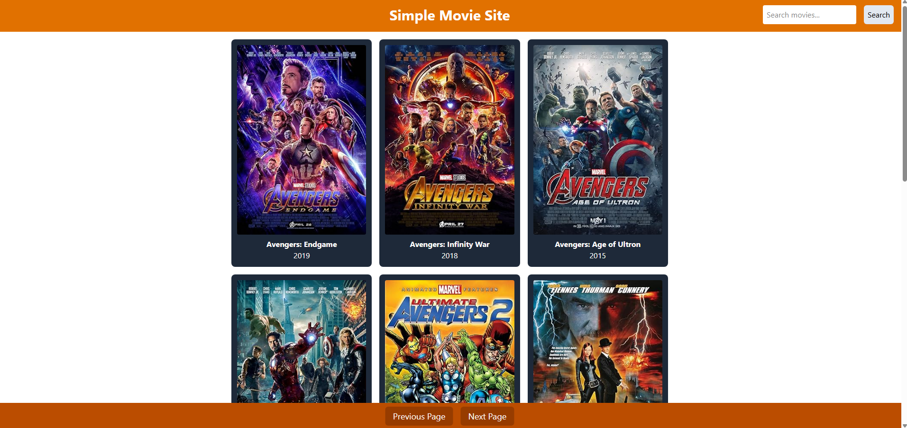

# Movie Explorer

A React web app that lets you search for movies and view details using the OMDB API.

---

## Features

- Search movies by title
- View movie details including poster, year, and plot
- Responsive design
- Handles missing or broken poster images

## Screenshots

A full view of the website with movies loaded:

gi
A view of the details page for a specific movie:


## Installation

1. Clone the repo:

   ```
   git clone https://github.com/username/My-Project.git
   ```

2. Install dependencies:
   ```
   npm install
   ```
3. Start the development server:

   ```
   npm start
   ```

---

## Usage

- Enter a movie title in the search bar.
- Click on a movie card to see details.
- Use the pagination buttons to browse multiple pages of results.

---

## Technologies

- React
- Tailwind CSS
- OMDB API
- JavaScript (ES6+)

---

## Notes

- Some movies may not have posters.
- Requires an OMDB API key.
